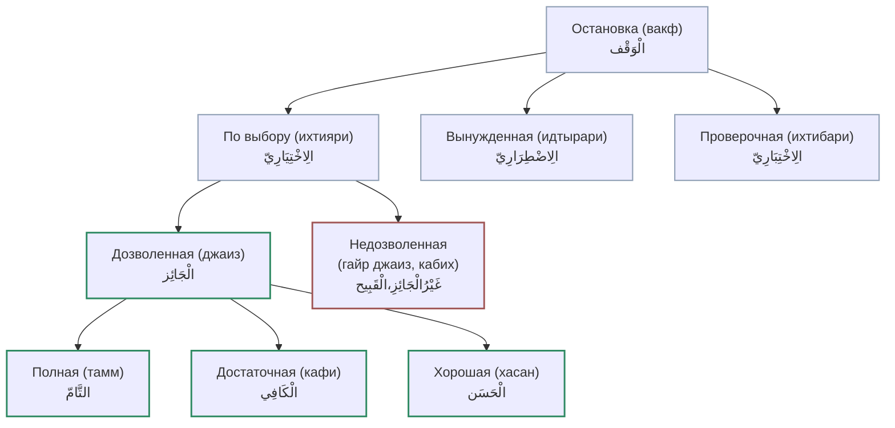

# Виды остановки

Останавливаясь на слове, чтец находится в **одном из трёх** положений:

## 1. Ихтияри (по выбору)

Остановился **свободно, по своему выбору**.

## 2. Идтырари (вынужденно)

Остановился **не по своей воле** — кончилось дыхание, забыл, чихнул, закашлялся и т. п.

## 3. Ихтибари (проверочно)

Остановился потому, что **устод проверяет** ученика: «как остановишься на таком-то слове?». Пример: «وَالْعَبْدِ بِالْعَبْدِ» — при остановке на «الْعَبْدِ» сходятся **две буквы калькаля** подряд («ба» — коренной сукун, «даль» — временный от вакфа), и нужно проявить калькаля каждой: «وَالْعَبْدْ» (калькаля «ба», затем «даль»). Это редкость, на которой проверяют.

## Деление по дозволенности

Дальше речь — о **ихтияри** (по выбору). Он бывает:

- **дозволенный (джаиз)**;
- **недозволенный (гайр джаиз)**.

Дозволенный делится на **три** вида (по аль-Джазари

> **ثَلَاثَةً تَامٌ وَكَافٍ وَحَسَنْ**

):

- **тамм** (полная),
- **кафи** (достаточная),
- **хасан** (хорошая).

А недозволенный — это **кабих** (безобразная) остановка («وَغَيْرُ مَا تَمَّ قَبِيحٌ»).

(Вынужденная и проверочная остановки выносятся за скобки — основное внимание на остановке **по выбору**.)

### Схема видов остановки

