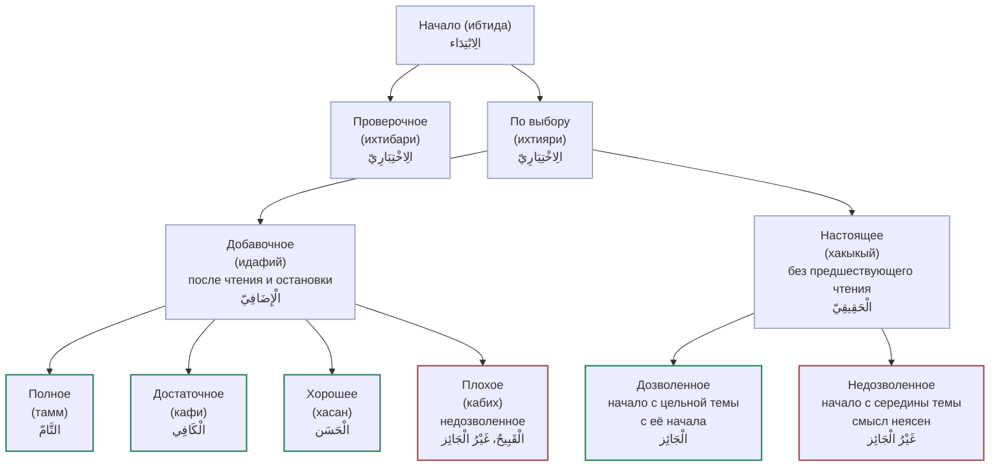

# Начало (ибтида): обзорная таблица

Вторая половина науки — **ибтида (начало)**. Как остановка не должна искажать смысл, так и начало не должно быть тёмным, искажать или переворачивать смысл. Аль-Джазари:

> **لَا بُدَّ مِنْ مَعْرِفَةِ الْوُقُوفِ وَالِابْتِدَاءِ**.

## Нет «вынужденного» начала

В отличие от остановки (которая бывает вынужденной), начало бывает только:

- **по выбору (ихтияри)**;
- **проверочное (ихтибари)** — устоз спрашивает, как начать с такого-то слова.

## Начало по выбору: два рода

**1. Настоящее (хакыкый) начало** — которому **не предшествовало** чтение этого отрывка (имам начал после Фатихи; чтец начал в меджлисе). Оно бывает:

- **дозволенное** — начать с **цельной темы с её начала** (например с начала суры; все начала сур — настоящее полное начало);
- **недозволенное** — начать **с середины темы** так, что слушатель не поймёт («ثُلَّةٞ مِّنَ ٱلۡأَوَّلِينَ», «قَالَ أَرَءَيۡتَ إِذۡ أَوَيۡنَآ...» — кто говорит, к кому?).

**2. Добавочное (идафий) начало** — которому **предшествовали** чтение и **остановка** (для вдоха/отдыха) в том же меджлисе. В нём дозволено то, что **не** дозволено в настоящем. Оно делится на:

- **тамм** (полное),
- **кафи** (достаточное),
- **хасан** (хорошее),
- и недозволенное — **кабих** (плохое).

Аль-Джазари

> **وَهْيَ تُقْسَمُ … ثَلَاثَةً تَامٌ وَكَافٍ وَحَسَنْ**

относит это деление к **добавочному** началу.

*Схема видов начала: проверочное и добровольное; добровольное делится на относительное (идафий) и истинное (хакыкый); истинное — на недозволенное и дозволенное; относительное — на плохое, хорошее, достаточное и полное.*

